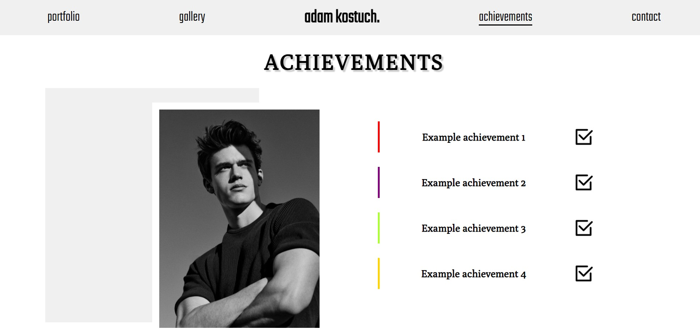
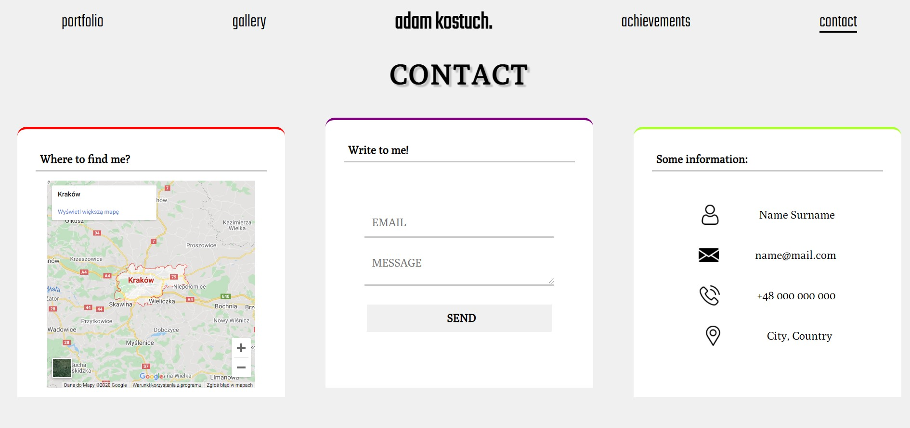

# CodersCamp 2020 - HTML & CSS Project | Adam Kostuch
## [Live preview](https://adam-kostuch.github.io/CodersCamp2020.Project.HTML-CSS.BusinessCard/)

## Table of Content:
  - [About](#about)
  - [RWD](#rwd)
  - [Navbar](#navbar)
  - [Main View](#main-view)
  - [Portfolio](#portfolio)
  - [Gallery](#gallery)
  - [Achievements](#achievements)
  - [Contact](#contact)
  - [Footer](#footer)
  
----
### About
Portfolio project is a template website for my future projects. It is just a foundation for a one-page website that I would like to create once I have just a bit more experience. Project includes a font from [Google Fonts](fonts.google.com/) and vector icons from [Flaticon](https://www.flaticon.com/).

----
###RWD 
This site is able to adapt to (probably) all possible resolutions.  Starting from the lowest possible resolution (1px) up to (1920px) which the side was created on.

----
### Navbar 
Navbar is a sticky menu that stays at the top of a page. That means whenever we want to scroll the page, the navbar will follow your moves. Navbar includes a hover animation based on ```::before```,  ```::after``` pseudo-elements and ```position: absolute``` css line. 


----
### Main View 
Main View of the page is the content that page visitor will see first after loading on the site. That includes three containters (two with background images) organized by ```position: relative ```. 


----
### Portfolio
Portfolio is a placeholder for future projects that will be uploaded on github. After hovering the photo you can visit demo of the project or see github repository by clicking the icons. 


----
### Gallery 
Gallery is a grid oriented section for pictures. This section (right now) contains 5 different example pictures that are responsive even with the weird resolutions. <br/>


----
### Achievements 
Achievements is the section including some personal accomplishments (it is also a placeholder for now). In this part of the website I used a ``` @keyframes ``` animation (the color changing line to the left of every achievement). 


----
### Contact 
Contact section is devided to three subsections. Left section is used to keep the location (of the place I live for example). Middle part is keeping the contact form.  Lastly there is a section to keep personal data to contact (without using a form). Also all of the containers inside ** Contact ** are having the ``` @keyfame ``` animation like in the achievement section. 


----
### Footer
Footer is a simple section at the bottom of the page keeping the authors &copy;Copyrights. 
